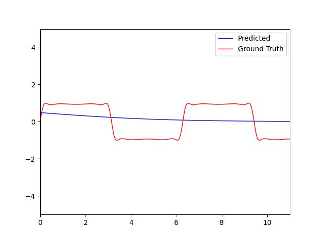

Introduction of Machine Learning - lab4 report
===
## 111062332 朱誼學

#### 1.	What are the differences between sigmoid and softmax activation functions, and why did we choose them for binary and multi-class classification respectively?

Sigmoid activation function will project the output's value within [0, 1]. Not only making it useful for predicting probabilities but also matching the required input for Binary cross entropy.
For a K classes classification problem, Softmax will output a K-elements vector and all the values are within [0, 1]. This vector is usually acted as a vector stores the probabilities each class may be chosen.

#### 2.	Why does the loss oscillate during model training?

i. Learning rate is too high: When the learning rate is set too high, the model makes large jump in the parameter space. Instead of smoothly converging the optimization process overshoots the optimal parameters, resulting in loss oscillation.  
ii. Batch size is too small: Using a very small batch size can cause noisy updates, leading to oscillation. This is because the gradient computed from a small batch may not accurately represent the overall loss landscape of the training set.

#### 3.	How does changing the learning rate and batch size affect the model training time?

A higher learning rate will need lesser iterations to reach the most optimal point, since it will make a large jump in parameter space. And a Higher batch size will reduce the number of iteration in each epoch, as it process more data at once.

#### 4.	My regression result: 
